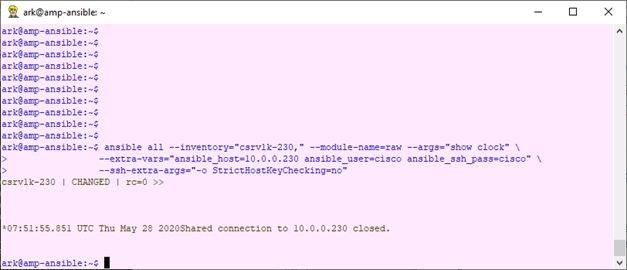
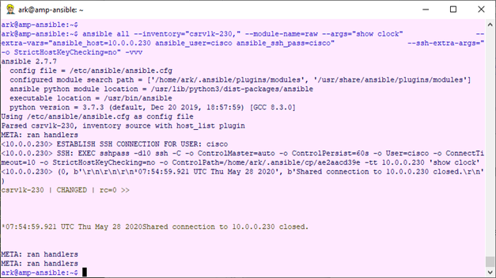

#  Jour 1 : Faire un show clock sur un routeur/switch

Comme annoncé, nous allons commencer tout petit : nous sommes sur une session Unix et notre but est d&#39;exécuter la commande « _show clock_ » en pilotant à distance un équipement Cisco. Si vous disposez d&#39;un autre équipement, vous pouvez évidemment substituer le show clock par toute autre commande brève.

En automatisation, une bonne habitude est de faire le travail au moins une fois à la main. Aussi, nous nous plaçons sur notre station linux et exécutons les commandes suivantes :

    $ ssh -l cisco 10.0.0.230
    Warning: Permanently added '10.0.0.230' (RSA) to the list of known hosts.
    Password:
    
    csrv1k-230#show clock
    *15:29:59.820 UTC Tue May 26 2020
    csrv1k-230#
    csrv1k-230#exit
    Connection to 10.0.0.230 closed.
    $

Arrêtons-nous quelques instants sur cette requête de routine pour tout expert réseau. Nous avons eu à fournir les données suivantes :

| | |
|-|-|
| **10.0.0.230** | L&#39;adresse IP de mon routeur |
| **show clock** | La commande à exécuter (bon là je ne vous apprends rien) |
| **cisco** | Le compte utilisé |
| **cisco** | Le password |

Nous avons aussi reçu une notification du système sur l&#39;échange des clefs publiques via la session SSH.

Evidemment, toutes ces informations devront être passées en paramètre à Ansible (et non, il ne les devine pas tout seul !).

## Installer ansible
Je vais passer rapidement sur l&#39;installation d&#39;Ansible, car cette partie est très bien documentée par ailleurs, et, à part peut-être montrer comment installer une version spécifique, ma valeur ajoutée devrait être faible.

### L&#39;installation
Il faut disposer a minima d&#39;un linux en mode serveur. Si vous ne pouvez pas installer une VM sous vmWare, une excellente alternative est d&#39;installer VirtualBox sur un PC Windows ou sur un MacBook et de créer sa VM sous VirtualBox. Pour des tests, un système avec 2gb de RAM et 16Gb de disque suffit amplement.

Par ~~fainéantise~~ habitude, j&#39;utilise la distribution debian, mais ubuntu convient également et CentOS est probablement le meilleur choix, puisque Ansible, comme CentOS sont maintenus par la même société.

Une fois connecté sur la VM, on lance l&#39;installation :

    $ apt-get install ansible
Ou

    $ yum install ansible

Cette procédure prend en charge l&#39;installation de plusieurs applications :

| | |
|-|-|
| **python** | langage de programmation de Ansible |
| **pip** | utilitaire de mise à jour des librairies python |
| **jinja2** | un langage de templating codé en python |
| **ansible** | ça on sait |
| **modules standard d&#39;ansible** | Une collection de modules |

### La mise à jour

La version installée d&#39;Ansible dépend de la distribution linux installée. On le vérifie en tapant :

    $ ansible --version

L&#39;utilisation du module _cli\_command_ nécessite la version 2.7. Si le package installé est inférieur, on procède à un upgrade via pip :

    $ pip install –upgrade "ansible==2.7.8"

## Ma toute première commande

La commande à exécuter est la suivante :

    $ ansible all --inventory="csrv1k-230," --module-name=raw --args="show clock" \
     --extra-vars="ansible_host=10.0.0.230 ansible_user=cisco ansible_ssh_pass=cisco" \
     --ssh-extra-args="-o StrictHostKeyChecking=no"

Bien entendu, l&#39;adresse IP du routeur doit être changée, ainsi qu&#39;éventuellement l&#39;authentification SSH.

On fera aussi bien attention à la virgule qui termine le paramètre inventory.

Nous pouvons également lancer cette même commande en mode verbose, en ajoutant l&#39;argument –vvv :

Nous voyons bien notre commande exécutée correctement même si la mise en forme de la réponse nous déçoit un peu.

### Installer son lab avec VyOS

Ceux qui n'ont pas d'équipements Cisco sous la main, peuvent suivre ce tutoriel en installant

[jour 2](day_02.md)
<!--stackedit_data:
eyJoaXN0b3J5IjpbLTEzOTQwMDk3NzIsLTE3Mzc3MDgwNTIsNj
AwNzU5NjkyXX0=
-->