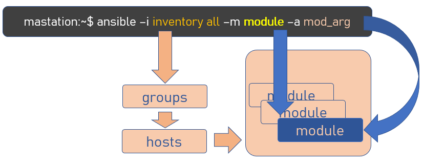

# Jour III :  actions et données :

Comme tout automate digne de ce nom, Ansible cloisonne les actions et les données. Les actions sont confiées aux modules, les données sont récupérées dans l'inventaire.

## Les actions : le module et les paramètres du module
Le module est l'entité d'Ansible qui effectue une tâche spécialisée. Nous avons vu qu'il y a des milliers de modules disponibles et nous allons en étudier 3.

La plupart des modules effectue les actions sur le serveur distant. Nous avons vu le module *raw* qui se contente de lancer la commande donnée en paramètre (ici *show clock*), ce qui est intuitif. Beaucoup moins intuitif pour nous, le module *copy* (qui copie des fichiers) ou le module *template* (qui sera vu en dernière journée) sont exécutés par défaut sur le serveur distant. 
Par exemple, voici ce qui arrive quand nous voulons lire le fichier "params.csv" avec le module file :

Et ce n'est pas ce nous voulons en réseau. Je radote encore, mais Ansible a été écrit pour administrer des serveurs, pas des routeurs. Bref, c'est nous, administrateurs réseaux, qui avons dévoyé l'usage d'Ansible.
D'ailleurs, il y a même un module nommé *local* pour effectuer des actions sur la station Ansible.

La clef, c'est le paramètre **--connection** (ou -c) qui spécifie la portée du module. Par défaut, connection est positionné à *ssh*, mais nous pouvons aussi préciser *local*, pour que l'action soit faite localement par la station Ansible. Nous pouvons finalement utiliser des templates, copier des fichiers, sans demander à nos routeurs des fonctionnalités Unix.

En version 2.7, une troisième option est ajoutée : c'est la valeur *cli_connection* qui permet de contrôler un distant, via des commandes locales, à la manière du module raw.

## Les données

Jusqu'ici, nous avons pu contrôler un seul équipement distant, ce qui reste éloigné de notre objectif d'automatiser un parc.

Le parc d'équipement est décrit dans le fichier inventaire. Par défaut, Ansible le recherche à l'emplacement /etc/ansible/hosts, mais même en lab, je vous invite à utiliser un fichier différent, qui sera communiqué à Ansible par le paramètre --inventory (ou -i). Par la suite, mon fichier inventory sera nommé inv.

Ce fichier respecte la syntaxe des fichiers Ini, en étant organisé en sections.
Les sections représentent des groupes de serveurs distants. Les clefs sont les serveurs, les valeurs sont optionnelles,  les variables spécifiques à un serveur. Enfin, sans surprise, la section pré-définie [all] est commune à l'ensemble des serveurs.
Nous pouvons par exemple organiser notre parc d'équipements réseau de la manière suivante :

    [routers]
    csrv1k-230
    csrv1k-231
    [switchs]
    sw-001
    sw-002

ou avec une petite astuce de notation  :

    [routers]
    csrv1k-[230:231]
    [switchs]
    sw-[001:002]

La sélection des hosts sur lesquels exécuter une commande est le seul paramètre d'Ansible qui n'a pas de préfixe. Les valeurs autorisées sont all, un nom de section ou un nom de host :

    ansible all -i inv
    ansible switchs -i inv
    ansible csrv1k-230 -i inv

Les variables spécifiques à chaque host sont données à la suite sur la même ligne.
Si nous reprenons notre commande initiale, nous avions les variables suivantes :
|||
|-|-|
|ansible_host|10.0.0.230|
|ansible_user|cisco|
|ansible_ssh_pass|cisco|

Nous pouvons les intégrer au fichier inventaire qui deviendra :

    [routers]
    csrv1k-230 ansible_host=10.0.0.230 ansible_user=cisco ansible_ssh_pass=cisco

Notre commande peut maintenant s'écrire plus simplement :

    $ ansible all -i inv -m raw -a "show clock"

all étant un filtre sur les éléments présents dans l'inventaire. On aurait aussi pu écrire :

    $ ansible routers -i inv -m raw -a "show clock"
    $ ansible csrv1k-230 -i inv -m raw -a "show clock"

Les paramètres contenus dans l'inventaire sont passés de manière implicite au module, comme schématisé ici :

Les variables communes peuvent être regroupées dans les sections [group:vars], par exemple, nous pouvons écrire l'inventaire de la façon suivante :

    [all:vars]
    ansible_user=cisco
    ansible_ssh_pass=cisco
    [routers]
    csrv1k-230 ansible_host=10.0.0.230

Note: une autre façon de renseigner les variables relatives aux hosts est d'utiliser les répertoires pré-définis *group_vars* et *hosts_vars*. Ansible va y chercher les fichiers :

    group_vars/all
    group_vars/routers
    hosts_var/csrv1k-230

et intègre leur contenu aux données de notre routeur. A la différence du fichier inventaire, ces fichiers doivent être écris en YAML.

Dans tous les cas, la syntaxe Ansible est identique :

## Automatiser

Nous avons appris à écrire un inventaire, organiser les données spécifiques aux hosts et aux groupes, filtrer les hosts concernés par une action. Bref, nous sommes prêts à lancer une commande sur un grand nombre de distants. 

Si notre fichier inventaire contient :

    [all:vars]
    ansible_user=cisco
    ansible_ssh_pass=cisco
    [routers]
    csrv1k-230 ansible_host=10.0.0.230 
    csrv1k-231 ansible_host=10.0.0.231 
    
Avec la commande 

    $ansible routers -i inv -m raw -a "show clock"

nous lançons une commande sur l'ensemble des hosts du groupe routers, soit 2 routeurs !!

Notons que l'exécution se déroule en parallèle et, par défaut, ansible lance jusqu'à 5 instances en même temps. Nous pouvons modifier ce comportement avec le paramètre *forks*.

[interlude 1](interlude_01.md)
<!--stackedit_data:
eyJoaXN0b3J5IjpbOTUwNjc4ODU1LDEwMzk5NzYwNTEsNjgzND
Y5MDksLTE1MDYyMjEzMzAsMTc0MTI0OTYxOCwtNTA0NDYzNzE3
LC0xNjUwMDY2MTg5LC0xNzEwNzMyODY4LC0xNTYwNjIwMzg0LC
0yMDQ2MzY1Mzg4LDE5NjAxNDQ0MTBdfQ==
-->