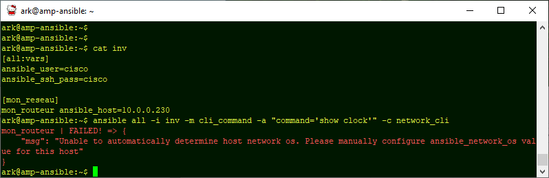
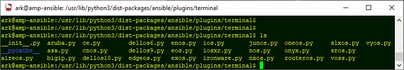
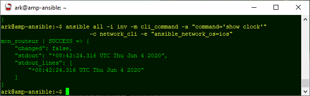
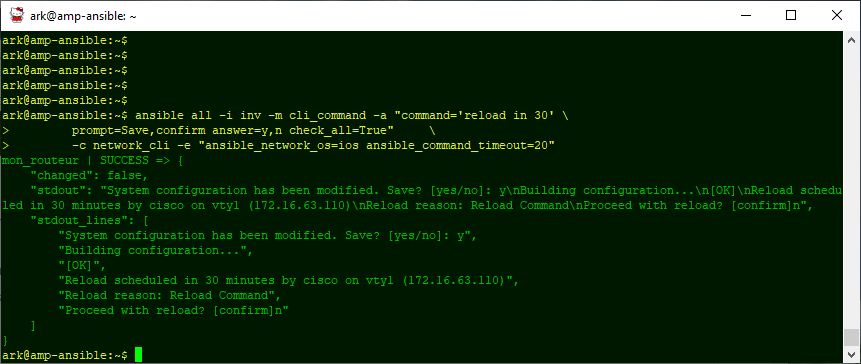

# Jour IV : Le module cli_command

Aujourd'hui: petite journée, puisque nous allons la passer à découvrir un seul module. Mais elle va nous servir à consolider tout ce que nous avons vu jusqu'ici. 

## Remplacement de raw

La documentation du module est disponible ici :
[https://docs.ansible.com/ansible/latest/modules/cli_command_module.html](https://docs.ansible.com/ansible/latest/modules/cli_command_module.html)

Nous regardons attentivement le tableau **Parameters** qui  liste les données attendues par le module, qu'on passera via le paramètre --args ou -a. 

Pour cli_command, le seul paramètre obligatoire est *command*, et précise la commande à exécuter.

Les arguments à passer à Ansible commencent à prendre forme :
|||
|-|-|
||la sélection des routeurs|
|-i| le fichier inventaire |
|-m| le nom du module : cli_command|
|-a|  les paramètres du module: command='ma commande'|

On n'oubliera pas le paramètre **connection** :
|||
|-|-|
|-c|network_cli (nécessaire au module cli_command)|

Dans le fichier inventaire, nous plaçons les variables spécifiques à chaque routeur : 

 - les identifiants de connexion qui sont communs à notre parc
 - la résolution nom vers adresse IP, puisque mes équipements ne sont pas connus par le DNS 

Et je lance ma commande :

Caramba encore raté !

En revanche, nous avons un message d'erreur tout à fait explicite (ce qui n'est pas toujours le cas avec Ansible !) : il manque la variable *ansible_network_os*.  

Première question : où va-t-on renseigner cette variable. Vous avez, bien sûr, en tête les différentes possibilités :

 - en global dans le fichier inventaire
 - pour chaque host du fichier inventaire
 - en ligne de commande avec le paramètre --extra-vars 

Ici je vais choisir le paramètre extra-vars qui a l'avantage d'être explicite, mais les autres choix sont respectables.

Le vrai problème, c'est surtout ce qu'on va mettre dans cette variable et la documentation n'aide pas franchement. Les différents OS supportés se retrouvent dans les plugins python installés par Ansible: pour initialiser le terminal ssh, le module appelle le fichier python <ansible_network_os>.py. Il suffit (!) donc de regarder les fichiers disponibles, ce sont toutes les valeurs possibles de la variable.

Ici nous utilisons un routeur Cisco classique, *ansible_network_os* sera positionné à "ios".
 
 La commande devient :

    ark@amp-ansible:~$ ansible all -i inv 
          -m cli_command -a "command='show clock'" 
          -c network_cli -e "ansible_network_os=ios"

Et là c'est gagné :

## Utilisation avancée

Ce module peut interpréter la réponse de l'équipement et répondre en fonction :

ici nous envoyons un reload, puis annulons l'opération :  

    :~$ ansible all -i inv -m cli_command 
                -a "command='reload' prompt='confirm' answer=n" 
                -c network_cli -e "ansible_network_os=ios"

Les paramètres *prompt* et *answer* peuvent être entrés sous forme de listes, si le dialogue entre le routeur et l'automate est un peu plus complexe :
  

    ansible all -i inv -m cli_command -a "command='reload in 30' \
            prompt=Save,confirm answer=y,n check_all=True"     \
            -c network_cli -e "ansible_network_os=ios ansible_command_timeout=20"

Ici, le module répondra 'y' quand le routeur demandera si la configuration doit être sauvée, et répondra 'n' pour confirmer le reboot.

La journée prochaine sera consacrée au formalisme des données, ensuite nous arriverons au playbooks..

[interlude_01](interlude_01)
<!--stackedit_data:
eyJoaXN0b3J5IjpbMTY4OTEyMDE2LC0xNjQxNzUwNjAwLDIxMD
czMTUzMDIsLTE3Mjg4Mjc1NjgsLTQxOTUxNzM1OCwyMDA3NjI2
NTQwLC0xNjcyMDY0ODEzLC02OTk0NjEwNjYsMTQ5NjYwNjg3OS
wtMTM2NDI4MjE0NCw3NzI3ODkyMTgsMTM3MTI0ODE2XX0=
-->