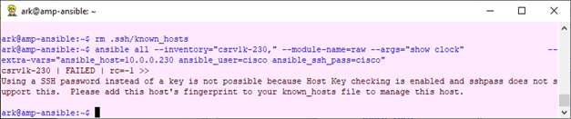
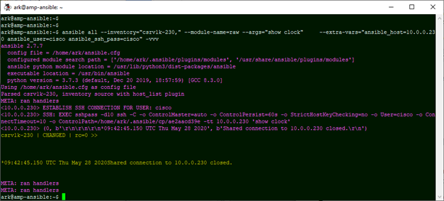
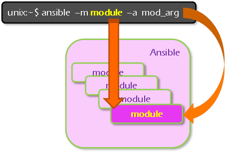

# Jour II : Comprendre la commande exécutée

Dans l&#39;article précédent, nous avons pu à partir d&#39;une session linux exécuter à distance un show clock sur un routeur : c&#39;est Ansible qui s&#39;est connecté en SSH sur le routeur et a lancé la commande. Il a ensuite fermé la connexion et nous a rendu la main.

> A la base, Ansible est un automate qui exécute des commandes à distance via SSH.

La commande était la suivante :

    ansible all --inventory="csrv1k-230," --module-name=raw --args="show clock" \
     --extra-vars="ansible_host=10.0.0.230 ansible_user=cisco ansible_ssh_pass=cisco" \
     --ssh-extra-args="-o StrictHostKeyChecking=no"

Et maintenant, nous allons procéder au reverse engineering de cette commande pour bien la comprendre. En d&#39;autres mots, que vient-on de faire ?

En ligne 2, nous retrouvons sans surprise les paramètres identifiés quand nous avons lancé la commande à la main. Ceux-ci sont toutefois encapsulés dans le paramètre extra-vars et sont passés à Ansible via des noms de variable pré-définis :

|||
|-|-|
| **ansible\_host** | 10.0.0.230 | L&#39;adresse IP de mon routeur |
| **ansible\_user** | cisco | Le compte utilisé |
| **ansible\_ssh\_pass** | cisco | Le password |

A noter que les noms de variable *ansible_ssh_pass* et *ansible_user* ont évolué et dépendent des versions d&#39;Ansible.

Voici la liste des autres paramètres passés :

| **Nom long** | **Nom court** | **description** |
| --- | --- | --- |
| *--module name* | -m | fonction (au sens Ansible) à exécuter |
| *--args* | -a | paramètres du module |
| *--inventory* | -i | La liste des hosts distants |
| *--extra-vars* | -e | informations additionnelles |
| *--ssh-extra-args* | | Paramétrage de la connexion ssh |
| *all* | | sélections des sites |

## Ansible.cfg

Réglons tout de suite le sort du paramétrage de ssh. Nous avons utilisé :

--ssh-extra-args="-o StrictHostKeyChecking=no"

Si nous enlevons ce paramètre, il est probable qu&#39;il ne se passe rien, mais si vous supprimez le fichier des hosts SSH avec lesquels les clefs publiques ont été échangées (~/.ssh/known\_hosts), Ansible refuse d&#39;établir la connexion SSH :

Ce choix se défend pour la gestion de serveurs, ce qui, ne l&#39;oublions pas, est le domaine d&#39;Ansible, mais il est plus discutable pour gérer des équipements réseaux et, incontestablement, il va nous embarrasser dans notre environnement de lab.

Aussi nous allons configurer notre station ansible pour qu&#39;elle accepte de se connecter à des hosts SSH quelconques.

Ansible récupère sa configuration dans le fichier

    /etc/ansible/ansible.cfg

et la retouche avec le fichier du répertoire courant, s&#39;il existe :

    ansible.cfg

Ces fichiers sont organisés avec la syntaxe INI :

    [section]
    parameter=value

Plutôt que de modifier le fichier partagé par tous les utilisateurs, nous allons créer le fichier ~/ansible.cfg, pour désactiver le contrôle des clefs publiques :

    $ echo -e "[defaults]\nhost_key_checking = False\n" > ansible.cfg

De plus, ceux qui utilisent un terminal de fond sombre apprécieront de pouvoir remplacer la colorisation bleu foncé des debugs par une couleur plus lisible avec la configuration suivante :

    $ echo -e "[colors]\nverbose = bright magenta\n" >> ansible.cfg

Nous avons retrouvé l&#39;environnement de lab qui nous convient et sommes enfin prêts à poursuivre notre tour d&#39;Ansible. J&#39;entends bien les plus râleurs dire « C&#39;est pas trop tôt », mais ils conviendront aussi qu&#39;on apprend mieux quand on est bien installé !

## La notion de module

Ansible est développé de façon modulaire. Le moteur délègue les tâches à des modules spécialisés. A ce jour il existe plus de 3000 modules supportés par Ansible ([https://docs.ansible.com/ansible/latest/modules/list\_of\_all\_modules.html](https://docs.ansible.com/ansible/latest/modules/list_of_all_modules.html)).

Dans notre exemple, nous avons utilisé le module le plus simple *raw* ([cf https://docs.ansible.com/ansible/latest/modules/raw\_module.html](https://docs.ansible.com/ansible/latest/modules/raw_module.html)), qui prend un paramètre [show clock] et l&#39;envoie à travers une session SSH.

Ou en prenant le problème à l&#39;envers, la commande à exécuter est passée via l&#39;argument –-arg [-a] qui sera passé par Ansible au module raw précisé par l&#39;argument –module-name [-m].

Soit, avec les notations courtes :

Notre module raw a donc :

- établi une connexion SSH avec le routeur et envoyé la chaîne « show clock », que le routeur a interprétée
- lu la sortie renvoyée par le routeur
- fermé la connexion
- retourné la sortie du routeur à Ansible

Même si d&#39;autres modules sont plus pertinents pour l&#39;administration réseau, on voit facilement qu&#39;avec ce module élémentaire, on peut lancer bon nombre de commandes sans quitter son terminal linux.

Les données (nom du routeur, adresse IP, compte, …) sont passées au module directement par Ansible, car Ansible considère à raison que ces paramètres appartiennent au moteur, non au module, établissant de ce fait un cloisonnement efficace entre les données et les actions (ce qui fait ma transition vers le prochain article).

[next](part
<!--stackedit_data:
eyJoaXN0b3J5IjpbNDA0NjU0NTQ2LC00ODgxNjYwMzNdfQ==
-->